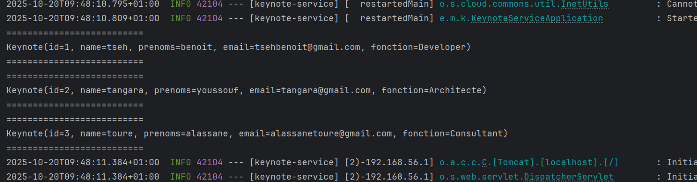
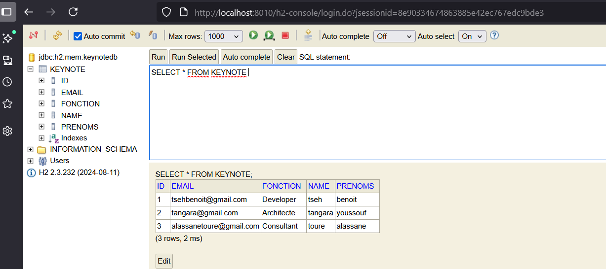
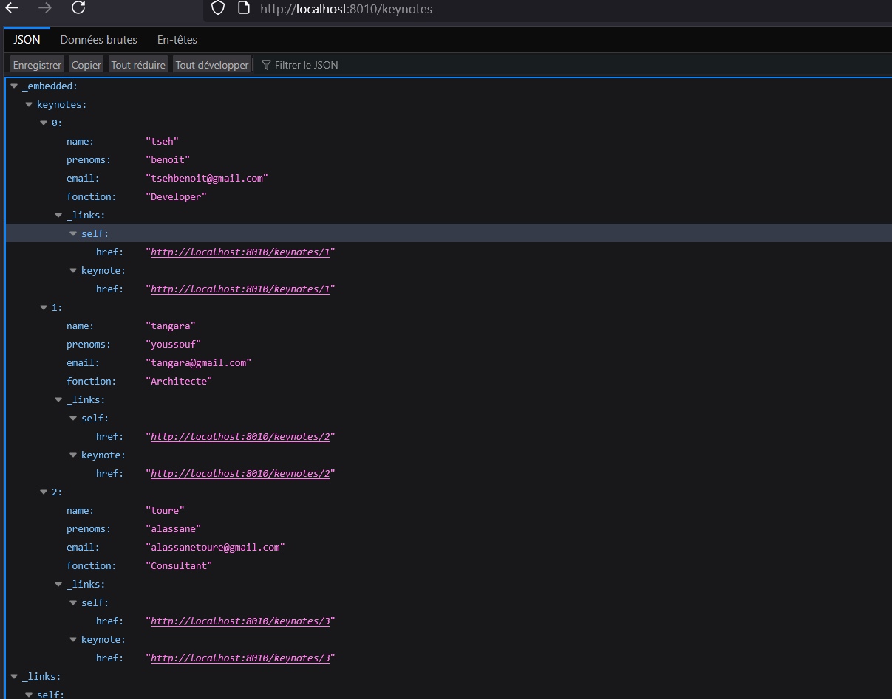
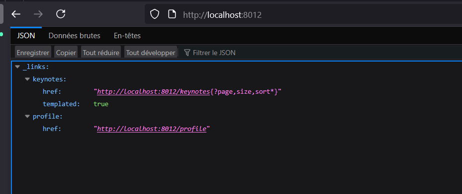

<h1>Keynote based Applications </h1>

<h2>Introduction</h2>

<h2> Keynote services</h2>

- test de l'inteface keynote Repository et de l'api RepositRestressources
    
    
    
    
    
    

<h2>Gateway service with Keynote services</h2>

- Creation du  gateway service avec les dépendance suivantes :

  - Spring cloud gateway
  - Spring Boot Actuator
  - Spring cloud Eureka client
  - Spring cloud cloud configuration

- Execution du gateway service interface 

